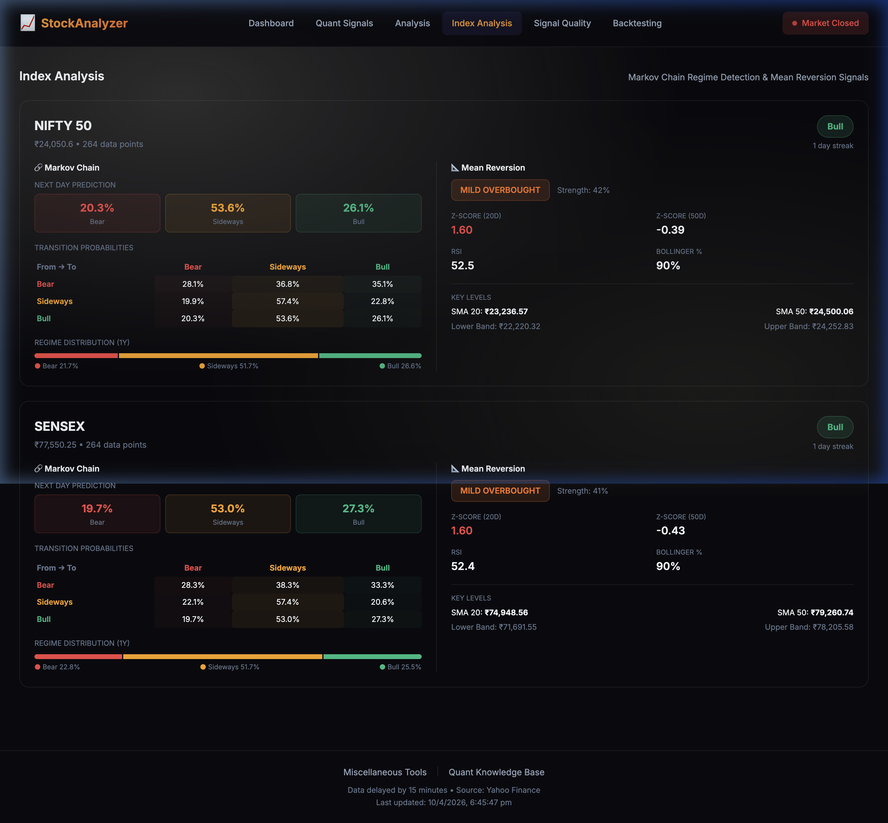
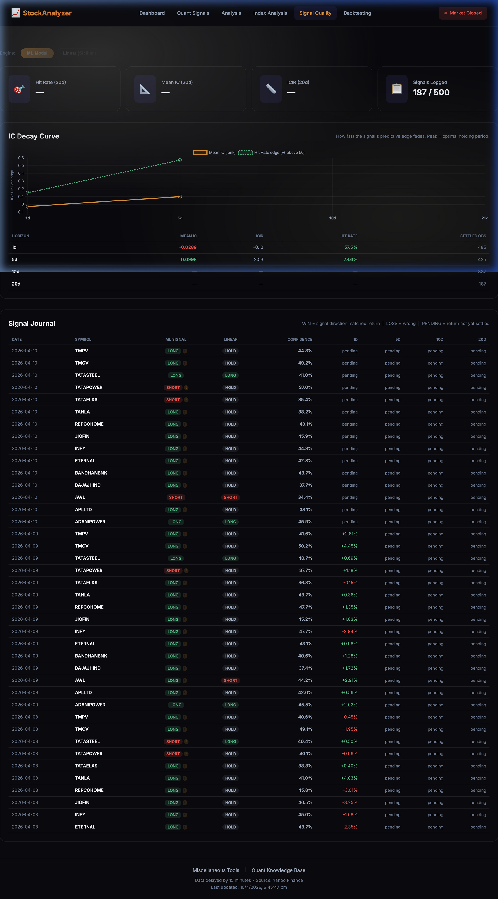
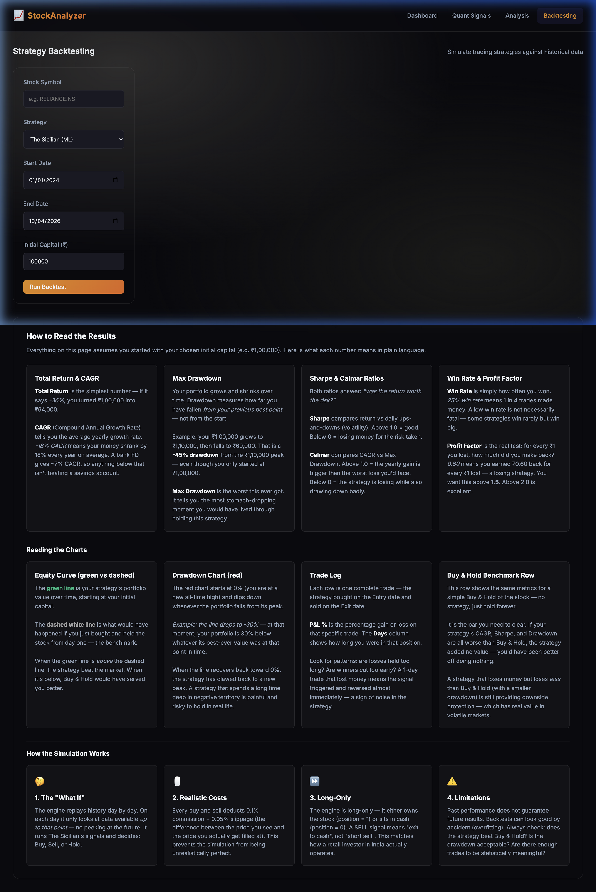
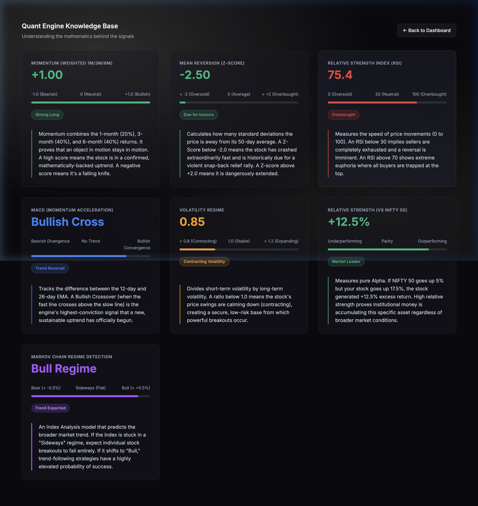

# 📈 Stock Portfolio Analyzer

A sophisticated, self-hosted web application for analyzing a personal portfolio of Indian (NSE/BSE) stocks. It combines a live dashboard, a multi-factor quantitative engine, an ML-powered unified decision system ("The Sicilian"), backtesting, Markov Chain market regime analysis, and a forward signal validation framework — all backed by a cloud Turso (libSQL) database and a dual-server architecture.

---

## Screenshots

### 🏠 Dashboard
Real-time holdings view with invested vs current value, daily P&L, sector allocation donut chart, and top performers bar chart.


### 🧠 Quant Signals — IC-Adaptive Factor Ranking
IC-weighted multi-factor scoring for every stock. Live "Active Factor Weights" panel shows how each factor is weighted dynamically based on its recent Information Coefficient.


### 📈 Technical Analysis
Per-stock deep-dive: RSI, MACD, Bollinger Bands, moving averages, risk metrics (Beta, Sharpe, VaR), fundamentals (P/E, P/B, ROE), analyst ratings, shareholding patterns, and recent news — all in one view.


### 🔗 Index Analysis — Markov Chain & Mean Reversion
Regime detection for NIFTY 50 and SENSEX using Markov Chain state transitions. Shows next-day Bear/Sideways/Bull probabilities, 1Y regime distribution, and mean reversion Z-scores with Bollinger key levels.


### 📐 Signal Quality — IC Decay & Signal Journal
Forward validation of trading signals. IC Decay curve shows how quickly the signal's predictive edge fades (peak = optimal holding period). Signal Journal tracks every logged signal with WIN/LOSS/PENDING outcomes.


### 🔬 Strategy Backtesting
Vectorized backtesting engine with equity curve, drawdown chart, per-trade log, and benchmarking vs Buy & Hold. Supports The Sicilian (ML), The Sicilian (Linear), and Regime Adaptive strategies.


### 📚 Quant Knowledge Base
Interactive reference explaining the mathematics behind every factor (Momentum, RSI, MACD, Bollinger, Volatility, Relative Strength, Markov Chain) in plain language with visual score tracks.


---

## Feature Overview

### 📊 Interactive Dashboard
- **Real-time holdings table**: LTP, net change, invested amount, current value, P&L (absolute + %)
- **Portfolio summary cards**: Total investment, current value, total P&L, today's change
- **Sector allocation donut chart** and **Top Performers bar chart** from live price data
- **Force Sync** button: triggers a full data refresh — fetches latest prices from RapidAPI/AlphaVantage/Yahoo Finance, syncs FII/DII flows, bulk/block deals, and India VIX into the database
- **Fetch Fundamentals** button: pulls company financials, analyst ratings, shareholding patterns, and recent news from RapidAPI (on-demand, rate-limited with key rotation)

---

### 🧠 Quant Signals (Multi-Factor IC-Adaptive Scoring)
Each stock in the portfolio is scored across **7 technical factors** using a Python-based quant engine (FastAPI on port 5001):

| Factor | What it measures |
|---|---|
| **Momentum** | Weighted 1M/3M/6M returns — trend continuation |
| **Bollinger** | Price position within 2σ bands — mean reversion proximity |
| **RSI** | 14-period Relative Strength Index — momentum exhaustion |
| **MACD** | EMA(12) − EMA(26) histogram & crossover direction |
| **Volatility** | Short-term vs long-term vol ratio — regime compression |
| **Volume** | Current vs 20-day average × price direction |
| **Relative Strength** | 63-day alpha vs NIFTY 50 benchmark |

**IC-Adaptive Weights**: Factor weights are not static. The engine calculates the rolling Information Coefficient (IC = rank correlation of score vs 20-day forward return) for each factor and dynamically up-weights factors that are currently predictive. The "Active Factor Weights" panel in the UI shows the live IC and weight for each factor.

Each stock gets a **composite score** (–100 to +100) and a signal: `LONG` / `HOLD` / `SHORT`. Cards are ranked by score.

---

### 🏯 The Sicilian — Unified Decision Engine
The Sicilian is the high-conviction per-stock decision system. It aggregates **16 sub-scores** (8 technical + 3 market-regime + 3 fundamental + 2 FII flow) into a single verdict:

**`BUY` / `HOLD` / `SELL`** with a confidence % and next-day target price.

**Sub-score breakdown (weights):**

| Category | Sub-scores |
|---|---|
| Technical (62%) | Composite Factor (14%), RSI (9%), MACD (9%), Trend MA (8%), Bollinger (7%), Volume (5%), Volatility (4%), Relative Strength (6%) |
| Market Regime (20%) | Sector Rotation (5%), VIX Regime (4%), NIFTY Trend (4%), Markov Regime (4%), Analyst Consensus (3%) |
| Fundamentals (18%) | Valuation — P/E, P/B, P/S (8%), Financial Health — CR, D/E, ICR, FCF (6%), Growth — revenue/EPS 3Y/5Y CAGR (4%) |
| FII Flows | FII Cash Flow Score, FII F&O Score (informational, not in weighted sum) |

**Scoring method**: The engine first tries the **ML Random Forest model** (see below). If the model isn't trained, it falls back to the linear weighted sum with BUY threshold ≥ 0.35, SELL ≤ −0.35.

**Output includes**: verdict, sicilian_score (–1 to +1), confidence, scoring method, ML class probabilities, target price, per-sub-score breakdown, support/resistance levels (SMA20, SMA50, Bollinger bands), and a plain-English reasoning string.

---

### 🤖 ML Signal Prediction (Random Forest)
A **scikit-learn Random Forest classifier** is trained on rolling historical sub-scores from all portfolio stocks. The model learns non-linear interactions between indicators (e.g., RSI oversold + MACD bullish crossover + volume spike is far stronger than the sum of its parts).

**Training pipeline**:
- **Labels**: 20-day forward return > +3% → BUY (1), < −3% → SELL (−1), else HOLD (0)
- **Features (14)**: rsi, macd, trend_ma, bollinger, volume, volatility, relative_strength, sector_rotation, vix_regime, nifty_trend, markov_regime, delivery_score, fii_flow_score, fii_fo_score
- **Architecture**: 300 estimators, max_depth=8, balanced class weights (tuned via TimeSeriesSplit walk-forward CV)
- **Bias prevention**: analyst_consensus excluded from training features (static 2026 ratings applied to 2023 historical bars = look-ahead bias); composite_factor excluded (noisy blend of other features)
- Runs: `python -m quant_engine.ml.trainer`

**Sector rotation** uses **real NSE sector indices** (fetched from the DB) rather than peer-averaging, providing cleaner and less noisy signals.

---

### 🔗 Index Analysis — Markov Chain Regime Detection
Applies a **Markov Chain Hidden Regime Model** to NIFTY 50 and SENSEX price history:
- Daily returns classified as Bear (< −0.5%), Sideways, or Bull (> +0.5%)
- **Transition probability matrix** built on a rolling 252-day window
- **Next-day probabilities** output: P(Bear), P(Sideways), P(Bull)
- **1Y regime distribution** shown as a colour-coded bar
- Paired with **Mean Reversion signals**: Z-Score (20D), Z-Score (50D), RSI, Bollinger %B, SMA20, SMA50, upper/lower Bollinger bands
- Regime output feeds into The Sicilian as the `markov_regime` and `nifty_trend` sub-scores

---

### 📐 Signal Quality — Forward Validation Framework
Tracks whether signals are actually predictive after they are generated:
- Every time `/api/quant/scores` is called, today's signals are persisted to the `signals_log` DB table
- **Information Coefficient (IC)**: Spearman rank correlation of signal vs 20-day forward return
- **ICIR** (IC Information Ratio): IC / std(IC) — measures consistency of the signal's predictive edge
- **Hit Rate**: % of signals where direction matched the 20-day forward return
- **IC Decay Curve**: IC computed at 5D, 10D, 20D, 60D horizons — peak = optimal holding period
- **Signal Journal**: Full table with every logged signal, forward return, and WIN/LOSS/PENDING verdict
- Supports toggling between **ML Model** and **Linear (Sicilian)** scoring for comparison

---

### 🔬 Strategy Backtesting
A vectorized event-driven backtester for simulating strategy performance on historical data:
- **Strategies available**: The Sicilian (ML), The Sicilian (Linear), Regime Adaptive, Buy & Hold
- **Configurable**: stock symbol, date range, initial capital
- **Realistic costs**: 0.1% commission + 0.05% slippage per trade
- **Long-only** (SELL signal = exit to cash, not short sell — matches Indian retail constraints)
- **Output metrics**: Total Return, CAGR, Max Drawdown, Sharpe Ratio, Calmar Ratio, Win Rate, Profit Factor, Trade Count
- **Charts**: Equity Curve (strategy vs Buy & Hold), Drawdown chart
- **Trade Log**: per-trade entry/exit dates, prices, P&L%, holding days
- **Buy & Hold benchmark** comparison row for every run

---

### 📰 Fundamentals Engine
Pulls rich fundamental data from **RapidAPI (Indian Stock Exchange API2)** with automatic key rotation across multiple keys:
- **Valuation**: P/E, P/B, P/S, EV/EBITDA, Dividend Yield
- **Profitability**: ROE (TTM + 5Y avg), Net/Gross/Operating Margins
- **Growth**: Revenue & EPS CAGR (3Y and 5Y)
- **Financial health**: Current Ratio, Debt/Equity, Interest Coverage, Free Cash Flow
- **Annual & Interim financial statements** (Income, Balance Sheet, Cash Flow)
- **Peer comparison** table with relative valuation
- **Analyst ratings**: Strong Buy / Buy / Hold / Sell / Strong Sell counts + consensus score
- **Shareholding patterns** by quarter (Promoter, FII, DII, Public)
- **Recent news** from the company's news feed
- All data cached in DB to minimize expensive API calls

---

### 🔔 FII/DII Flow Signals
- **FII Cash Flow**: Daily institutional net buy/sell data (from NSE CSV or Python scraper), stored in DB
- **FII F&O Positioning**: Net index futures long/short positions
- Both signals are converted to a rolling 10-day percentile score (–1 = max outflow, +1 = max inflow) and fed into The Sicilian and the ML model as market-wide contextual features

---

### 📦 Bulk & Block Deals Tracker
- NSE bulk and block deal data fetched daily during Force Sync
- Stored in DB per stock with client name, quantity, price
- Accessible via API `/api/bulk-deals/:symbol`

---

### 🇮🇳 India VIX Regime Signal
- India VIX data scraped from NSE on every Force Sync
- Stored in `market_regime` table
- Converted to a rolling percentile score: Low VIX (calm) → +1, High VIX (fear) → −1
- Used as `vix_regime` sub-score in The Sicilian and ML training features

---

### 💾 NSE Delivery Data
- NSE delivery volume (% of total traded volume) fetched and stored per stock per day
- Converted to a rolling z-score vs 60-day mean, clipped to [−1, +1]
- Used as `delivery_score` feature in ML training
- High delivery % = smart money conviction; low delivery % = speculative froth

---

## Technology Stack

| Layer | Technology |
|---|---|
| **Frontend** | Vanilla JavaScript (ES6+), HTML5, CSS3, Chart.js 4 |
| **Backend** | Node.js 18+, Express.js (port 3000) |
| **Quant Engine** | Python 3.9+, FastAPI, NumPy, Pandas, scikit-learn, joblib, uvicorn (port 5001) |
| **Database** | Turso (libSQL, cloud-hosted) — replaces local SQLite |
| **Price Data** | RapidAPI (Indian Stock Exchange API2), AlphaVantage (weekly historical backfill), Yahoo Finance (fallback) |
| **Fundamentals** | RapidAPI (Indian Stock Exchange API2) |
| **News** | MarketAux API |
| **Market Data** | NSE India (VIX, delivery, FII/DII, sector indices, bulk deals) |

---

## Local Setup

### 1. Clone the repository
```bash
git clone <your-repo-url>
cd PersonalStockAnalyser
```

### 2. Install dependencies
```bash
npm install
pip install -r quant_engine/requirements.txt
```

### 3. Configure environment variables
Copy `.env.example` to `.env` and fill in your keys:
```env
PORT=3000
NODE_ENV=development

# Turso (cloud database)
TURSO_DATABASE_URL=libsql://your-db.turso.io
TURSO_AUTH_TOKEN=your_turso_token

# RapidAPI (Indian Stock Exchange API2) — used for prices + fundamentals
RAPIDAPI_KEY=your_key_here
RAPIDAPI_KEY_2=your_backup_key
RAPIDAPI_KEY_3=your_backup_key

# AlphaVantage — used for weekly OHLCV backfill
ALPHAVANTAGE_KEYS="KEY1,KEY2,KEY3"

# MarketAux — for news feed
NEWS_API_TOKEN=your_news_token

# Email alerts (optional)
EMAIL_USER=your-email@gmail.com
EMAIL_PASS=your-app-password
```

### 4. Start the application
```bash
npm run dev:all
```
This starts both the Node.js Express server (`:3000`) and the Python FastAPI quant engine (`:5001`) concurrently.

### 5. Access the app
Navigate to `http://localhost:3000`

---

## Scripts

| Command | Description |
|---|---|
| `npm run dev:all` | Start both Node.js + Python servers |
| `npm run stop` | Kill both servers (clears ports 3000 & 5001) |
| `npm run stop && npm run dev:all` | Clean restart |
| `python -m quant_engine.ml.trainer` | Retrain the Random Forest model |
| `python -m quant_engine.data.av_weekly_backfill` | Backfill weekly OHLCV via AlphaVantage |

---

## Architecture

```
Browser (port 3000)
    ↕ REST API
Node.js / Express
    ├─ /api/portfolio        → Turso DB (cached prices)
    ├─ /api/quant/*          → Python FastAPI (port 5001) proxy
    ├─ /api/sicilian/*       → Python FastAPI (port 5001) proxy
    ├─ /api/fundamentals/*   → Turso DB (cached fundamentals from RapidAPI)
    └─ /api/signal-quality   → Python FastAPI (port 5001) proxy

Python FastAPI (port 5001)
    ├─ /api/scores           → Multi-factor composite scoring (IC-adaptive)
    ├─ /api/sicilian/:symbol → The Sicilian unified decision engine
    ├─ /index-analysis       → Markov Chain + Mean Reversion on NIFTY/SENSEX
    ├─ /api/quant/backtest   → Vectorized backtesting engine
    ├─ /api/quant/signal-quality → IC, ICIR, Hit Rate, IC Decay, Signal Journal
    └─ /api/sync/fii, /api/sync/vix → NSE data ingestion

Turso (libSQL cloud)
    ├─ price_history         → OHLCV per stock+date
    ├─ sector_indices        → NSE sector index OHLCV
    ├─ fundamentals          → Company financials (RapidAPI)
    ├─ signals_log           → Historical signals + forward returns
    ├─ fii_dii_flows         → Daily FII/DII cash flows
    ├─ market_regime         → India VIX + derived scores
    └─ bulk_block_deals      → NSE bulk/block deals
```

**Key design decisions:**
- **Rate-limit resilience**: Multiple API key rotation for RapidAPI and AlphaVantage. Intelligent SQLite/Turso caching avoids redundant calls — current price is reconstructed from cached 1Y history when available.
- **Dual-engine design**: Node.js handles CRUD, caching, and serving the UI; Python handles all computationally intensive quant work.
- **Look-ahead bias prevention**: The ML training pipeline explicitly excludes any features that would not have been available at training time (e.g., analyst ratings from 2026 used for 2023 bars).
- **Turso migration**: The database was migrated from local SQLite to Turso (libSQL) for cloud-hosted persistence and multi-device access.

---

## License
MIT
