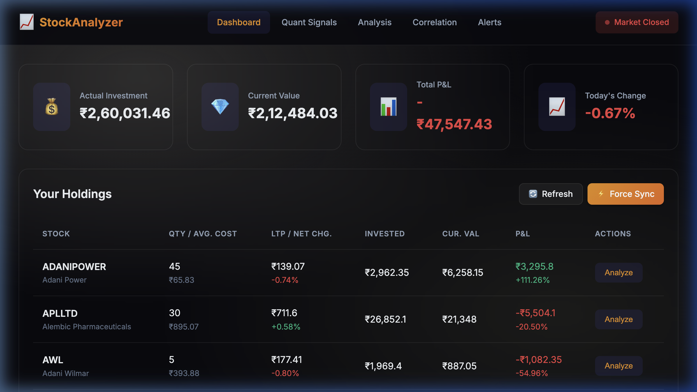
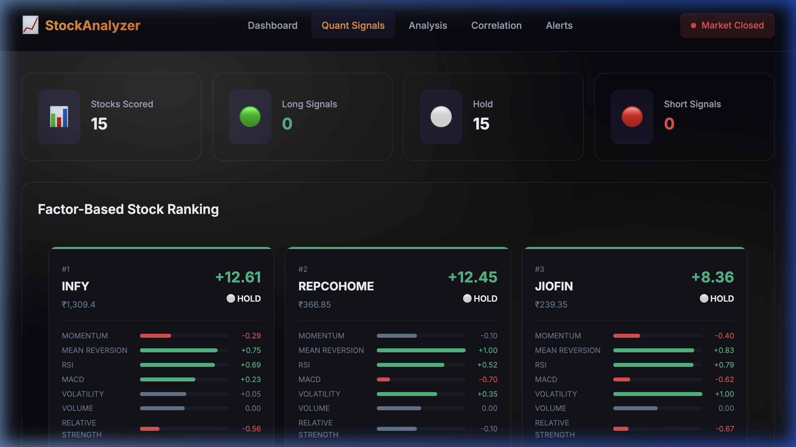
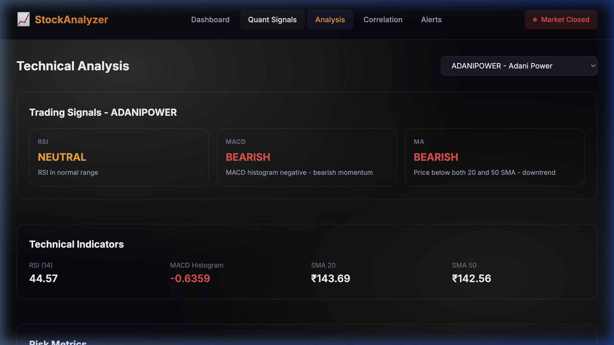
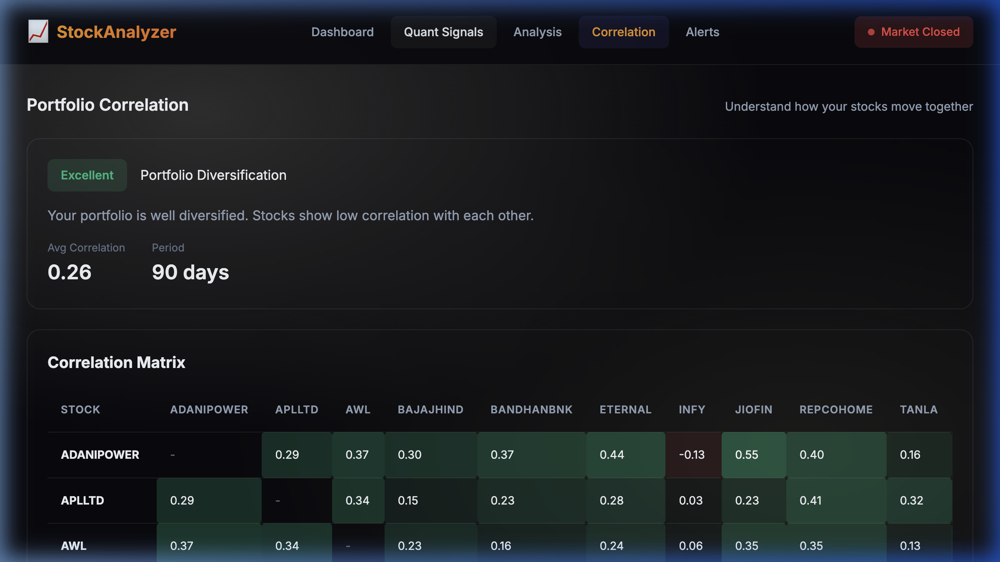
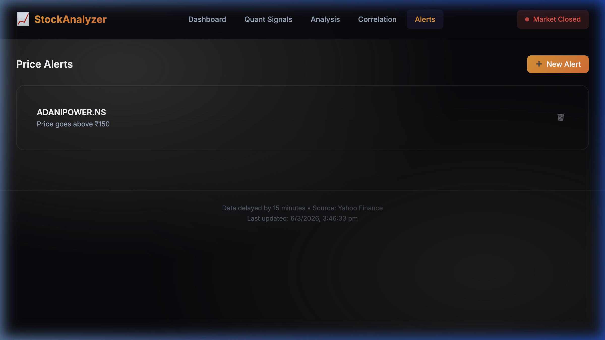

# Stock Portfolio Analyzer

A sophisticated, real-time web application for analyzing a portfolio of Indian (NSE/BSE) stocks. It provides deep technical analysis, multi-factor quantitative scoring, correlation tracking, and dynamic risk assessment using RapidAPI historical data, a Python-based quant engine, and an intelligent local SQLite caching system.

## Features

### 📊 Interactive Dashboard
A unified view of your entire portfolio, featuring real-time prices, daily P&L, invested vs. current value summaries, and sector allocation charts.


### 🧠 Quant Signals (Multi-Factor Scoring)
A Python-powered quantitative engine that scores every stock in your portfolio across 7 factors — Momentum, Mean Reversion, RSI, MACD, Volatility, Volume, and Relative Strength — producing composite long/hold/short signals with a ranked card view.


### 📈 Deep Technical Analysis
Select any stock to view automatically calculated trading signals (RSI, MACD, Moving Averages) and risk metrics like Annualized Volatility, Beta vs. NIFTY 50, Sharpe Ratio, and 95% Value at Risk.


### 🔗 Correlation Matrix
Discover how your holdings relate to each other. The correlation grid automatically highlights stocks that move together (positive) and ones that diverge (negative), generating an overall diversification score for your portfolio.


### 🔔 Price Alerts System
Set custom trigger points for any stock. The application actively tracks local thresholds and triggers notifications when key levels are breached.


## Technology Stack

- **Frontend**: Vanilla JavaScript (ES6+), HTML5, CSS3, Chart.js
- **Backend**: Node.js, Express.js
- **Quant Engine**: Python 3, FastAPI, NumPy, Pandas
- **Database**: SQLite (for lightning-fast historical quote caching)
- **Data Source**: RapidAPI (Indian Stock Exchange API2)

## Local Setup

1. **Clone the repository:**
   ```bash
   git clone <your-repo-url>
   cd PersonalStockAnalyser
   ```

2. **Install dependencies:**
   ```bash
   npm install
   pip install -r quant_engine/requirements.txt
   ```

3. **Configure Environment Variables:**
   Rename `.env.example` to `.env` and insert your RapidAPI Key:
   ```env
   PORT=3000
   NODE_ENV=development
   RAPIDAPI_KEY="your_api_key_here"
   ```

4. **Start the Development Server:**
   ```bash
   npm run dev:all
   ```
   This starts both the Node.js server (port 3000) and the Python Quant Engine (port 5001).

5. **Access the application:**
   Navigate your browser to `http://localhost:3000`.

## Architecture Highlights
- **Rate-Limit Resilience:** Initially fetching from Yahoo Finance caused 429 IP bans. The architecture was overhauled to use RapidAPI.
- **Intelligent Caching System:** To eliminate redundant API calls for current prices, the backend intercepts requests, analyzes the locally cached `1y` SQLite historical data, and constructs a current quote instantly without external network latency.
- **Dual-Engine Design:** The Node.js backend handles portfolio CRUD and data caching, while a separate FastAPI-based Python quant engine performs factor scoring and signal generation.

## Project Start Stop instructions
- `npm run dev:all`	Start both servers
- `npm run stop`	Kill both servers
- `npm run stop && npm run dev:all`	Clean restart

## License
MIT
