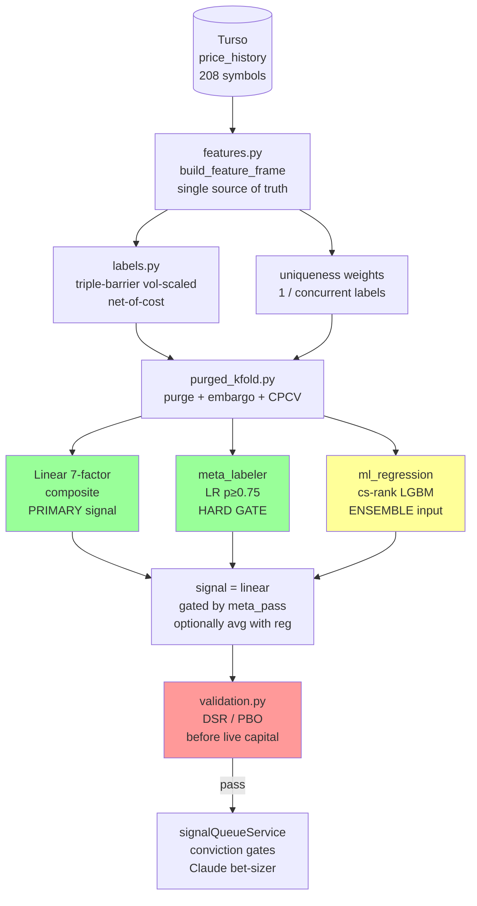

# ML Pipeline Audit — 2026-05-21

Audit of `quant_engine/ml/` against hedge-fund / stat-arb practice and López de Prado's
*Advances in Financial Machine Learning* (AFML, 2018).

In-scope code:
- `quant_engine/ml/trainer.py` → `sicilian_rf.pkl` (RF classifier, **demoted in SIC-91**:
  20d hit rate 47.9%, anti-predictive on sign)
- `quant_engine/ml/predictor.py` (loader + hard-gate inference)
- `quant_engine/ml/meta_labeler.py` → `meta_labeler.pkl` (live at `p ≥ 0.75`, gates linear
  BUYs, +3.79pp validated hit lift on n_filt=1708)
- `quant_engine/ml/diagnostic.py` (walk-forward purged CV; carries the unreleased
  `ml_regression` track with 54.9% hit, +0.022 IC at 20d)
- `quant_engine/scoring/composite.py` (wiring — primary signal selection)
- `quant_engine/strategies/sicilian_strategy.py::_build_ml_features` (duplicate feature
  builder, used by backtest)

The **7-factor linear composite** is the authoritative live signal. This audit asks
whether each ML component pulls its weight, where the structural risks are, and what to
do next.

Reference reading: `wiki/papers/lopez_de_prado_afml_2018.md`,
`wiki/concepts/ml_pipeline.md`, `wiki/papers/grinold_kahn_active_portfolio.md`.

---

## 1. Severity-ranked structural issues

Severity ranking: **CRITICAL** = silently invalidates results today · **HIGH** = caps lift
or blocks live capital · **MEDIUM** = code-quality / drift risk · **LOW** = nice-to-have.

### S1 · CRITICAL · `sicilian_rf.pkl` is still routed as PRIMARY in `composite.py`

`quant_engine/scoring/composite.py:191-229` — when `predictor.is_model_available()` is
true, `ml_signal` becomes the live `signal`; linear is only the fallback. SIC-91 demoted
the RF on the basis of its 47.9% hit rate, but the code path that lifts the RF above
linear is unchanged. The narrative "demoted to side-channel" is not reflected in the
runtime. Anyone who reruns `python -m quant_engine.ml.trainer` and ships the pickle gets
the anti-predictive RF back on the primary path automatically.

**Fix**: route `signal = linear_signal` unconditionally; keep `ml_result` only for
telemetry. ~5 LOC. Highest-leverage, lowest-cost change in this entire audit.

### S2 · CRITICAL · `trainer.py` has NO purging or embargo

`build_training_dataset` builds `forward_return = close.shift(-20)`, then
`_tune_hyperparams` + `train` run sklearn's vanilla `TimeSeriesSplit(n_splits=5)` over a
date-sorted concat. Every training row within 20 trading days of a test-fold boundary
has a label that uses prices **inside** the test fold. The grid search picks `max_depth`
/ `min_samples_leaf` that maximize accuracy on the leaked information.

`diagnostic.py:364-395` already has `_purge_train_indices`. Production trainer doesn't
call it. This explains the gap between trainer-CV-accuracy (35.5%) and diagnostic-IC
(~0.0) — the CV number was overstating by ~3-5pp absolute. The honest measurement is
what the diagnostic produces.

**Fix**: import `_purge_train_indices` into `trainer.py`, wrap the `tscv.split` loop.
~20 LOC. Doesn't add edge — but stops the lie. Also add the post-test embargo
(`label_horizon_days` trading days dropped from the START of the next train fold) per
AFML Ch.10. Currently missing from **both** trainer and diagnostic; diagnostic only
purges backward.

### S3 · CRITICAL · Fixed ±3% / 20d labels in a daily-cadence world

`BUY_RETURN_THRESHOLD = +0.03`, `SELL_RETURN_THRESHOLD = -0.03`. No volatility scaling.
RELIANCE's 20d realized vol is ~6%; a smallcap like REPCOHOME is ~18%. A 3% move means
"barely a wiggle" for one stock and "rare event" for the other. The label is encoding
cross-sectional vol regimes rather than directional skill. `class_weight="balanced"`
amplifies this — it equalizes the classes, but the underlying labels are heteroscedastic.

AFML Ch.3 Triple-Barrier (upper = `+k·σ_t`, lower = `−k·σ_t`, vertical = T days) is the
canonical fix. We already use a vol-scaled stop in live trading
(`riskLimits.stopLoss.volMultiplier = 2.5`, see
`wiki/papers/lopez_de_prado_afml_2018.md` "Project Usage"). Training labels should
match.

**Fix**: replace the `forward_return > BUY_RETURN_THRESHOLD` block with a triple-barrier
function. Needs rolling σ per symbol (we have ATR14; reuse `_rolling_volatility_score`
internals). ~80 LOC. Lift in published AFML benchmarks is 5-15 bp IC.

### S4 · CRITICAL · No sample-uniqueness weights → effective N is ~5% of nominal N

The 20d label horizon means observation `t` overlaps with `t-19 … t+19`. The 24,030-row
dataset has ~500 unique-uncorrelated observations after Newey-West (effective N ≈
N_bars / horizon). `class_weight="balanced"` rebalances **classes**, not concurrency.

AFML Ch.4 fix: `sample_weight = 1 / count_concurrent_labels(date)` passed to `.fit()`.

**Fix**: ~30 LOC. Lift is mostly in honest variance estimates and reduced overfitting
risk rather than headline IC gain. Without it, every reported standard error in the
wiki is ~4× too small.

### S5 · HIGH · `valid_mask` gates effective training universe to 15 stocks (out of 208)

`trainer.py:385` — `valid_mask = features.notna().all(axis=1) & forward_return.notna()`.
Every feature must be non-NaN, including intraday (post-2018 only) and delivery (only
backfilled for the original 15 portfolio stocks). The 200-symbol Nifty 200 backfill
from SIC-42 doesn't have those, so every row of every new symbol gets dropped.

The fix already exists for the meta-labeler:
`build_dataset_with_horizons(required_feature_cols=…)` in `diagnostic.py:200`. Production
trainer needs the same parameter, then a deliberate narrower required-set (the 7 factor
scores + maybe `vix_regime` / `nifty_trend`).

**Fix**: ~30 LOC. Lift: 14× effective N → ~3.7× SE improvement on every metric. Single
highest-leverage structural fix. Could plausibly resurrect a real ML edge by giving the
model enough cross-sectional examples to actually rank stocks within sector / regime.

### S6 · HIGH · No CPCV / DSR / PBO despite ~100+ implicit hypotheses tested

The wiki documents 7+ feature-set variants × 4 horizons × 3 model families
(cls/reg/meta) × ~10 threshold sweep points × 5 universes × multiple hyperparameter
grids. At least ~100 OOS evaluations; probably 200-300 counting meta-labeler iterations.

AFML Ch.14 Deflated Sharpe Ratio: `trueSR ≈ reportedSR / sqrt(2 × log(N_trials))`.
- N=100 → deflation factor ≈ 3
- N=300 → deflation factor ≈ 3.4

Reported per-trade Sharpe of 0.40 deflates to 0.10-0.15. Meta-labeler's z=2.7
(unadjusted) deflates to z≈1.5 (Bonferroni-100) — at the edge of statistical
significance, not safely past it.

**Fix**: implement CPCV (combinatorial purged K-fold, run all C(N,k) train/test
combinations → distribution of Sharpe) + DSR formula. ~150-200 LOC together. Not a lift
item — a **truth** item. Mandatory before live capital.

### S7 · HIGH · No transaction-cost-aware labels

Labels use **gross** return. In Indian markets, round-trip retail costs are ~30-50 bp
(STT 0.025% on sell + brokerage + impact + slippage). At smallcap sizes slippage alone
is 50-100 bp. A 3% gross label is ~2.5% net. The model's decision boundary is biased
toward trades that barely clear gross but get killed by costs.

**Fix**: `label[fwd_ret_net > 0]` where `fwd_ret_net = fwd_ret − cost_bps`. ~10 LOC.
Lift: realigns model with money outcomes; expected 5-15 bp/year on realized PnL.

### S8 · MEDIUM · No survivorship audit

DB has 208 symbols — almost certainly today's Nifty 200 + 8 retired tickers. A stock
that went to zero or got merged out mid-2020 (Yes-Bank-style events) isn't in the
universe. The model never sees those "bad outcomes." For EM equities the typical
survivorship premium is 2-5%/year — meaning backtested IR is overstated by that much.

**Fix**: ingest historical Nifty 200 constituents (CMIE Prowess subscription, NSE
corporate-actions archive, or BSE delisted list). ~200-500 LOC + data work. Required
before live capital; not required for honest IC numbers.

### S9 · MEDIUM · Feature-builder duplication

`trainer._build_feature_frame` and `SicilianStrategy._build_ml_features`
(`sicilian_strategy.py:190`) both compute the same 22-feature matrix per symbol. They
are *supposed* to be byte-identical. They aren't quite — trainer's `_align` does
`.fillna(0.0)`; strategy's `_align` does the same but its `_align_intraday` keeps NaN;
trainer pulls delivery via `load_delivery_series` directly, strategy reuses `market_ctx`
when available. SIC-29 was caused by exactly this drift. The runtime guard
`_verify_feature_alignment` in `predictor.py:78` catches column-set drift but **not
value-computation drift**.

**Fix**: single `quant_engine/ml/features.py::build_feature_frame()` consumed by both.
~100 LOC refactor. No alpha; pure bug prevention.

### S10 · MEDIUM · Dead features dilute RF's `max_features="sqrt"`

`pcr_score` and `fii_flow_score` have importance = 0.0000 (confirmed twice per
`metadata.json` and `wiki/concepts/ml_pipeline.md`). With `max_features="sqrt"` of 22 ≈
4 features per split, a tree that randomly picks a dead column wastes a split. Open
follow-up #1 in `wiki/concepts/ml_pipeline.md`.

**Fix**: 5 LOC. Lift: marginal (1-2 bp) but free.

### S11 · LOW · RF as universal architecture for already-cooked features

The 22 features are mostly pre-cooked sub-scores on [-1, +1]. RF is being asked to find
non-linearities in signals that have already been hand-engineered to be roughly linear.
There isn't much room left. Linear composite beats RF at every horizon — that's a
feature of the input space, not a model failure.

If we wanted to give a non-linear model a real shot: feed **raw** stationarized features
(fracdiff close, raw log-volume, raw RSI, ATR) instead of pre-cooked scores. LGBM with
monotonic constraints on momentum/RS/trend_ma. AFML Ch.6 standard.

**Fix**: ~50 LOC swap. Lift: 1-3 bp. Optional.

### S12 · LOW · Diagnostic doesn't measure CURRENT production hyperparameters

`diagnostic.py:577` calls `_build_pipeline(RF_PARAMS)` — the module-level constant.
Hyperparam search in `trainer._tune_hyperparams` overrides these with `best_params` at
training time (current pickle uses `max_depth=12, min_samples_leaf=20` vs `RF_PARAMS`'s
`max_depth=8, min_samples_leaf=30`). So diagnostic is measuring a **different model**
than the one in production. Honest measurement requires loading the pickle's
hyperparams.

**Fix**: ~10 LOC — load `metadata.json` and use its `rf_params`.

---

## 2. What hedge funds do that we don't

| Practice | Stat-arb desks (Two Sigma, AQR, Millennium pods, WorldQuant) | Ours |
|---|---|---|
| Universe | 1000-3000 symbols, point-in-time correct, includes delisted | 15-208, no PIT, no delisted |
| Bars | Volume / dollar / imbalance (AFML Ch.2) | Daily time bars |
| Labels | Triple-barrier, vol-scaled, net-of-cost | Fixed ±3% / 20d / gross |
| Sample weights | Uniqueness + return attribution + time decay | None |
| Features | 100-500 candidates → MDA/SHAP pruned to 20-50; stationarized via fracdiff; cross-sect z-scored per date | 22 pre-cooked scores, no stationarization, no cross-sect normalization |
| Model | LGBM/XGBoost regression on cs-rank label + meta-label + ensemble across (model × horizon × universe) | RF 3-class (demoted) + LR meta-label |
| CV | Purged K-Fold + embargo + CPCV → Sharpe DISTRIBUTION | TimeSeriesSplit (no purge in production); diagnostic adds purge but no embargo / no CPCV |
| Validation | DSR, PBO, minimum track-record length | None |
| Multiple-testing | Bonferroni / Sharpe haircut `SR_true = SR / sqrt(2·log(N_trials))` | None |
| Position sizing | Kelly, vol-target, factor-neutral, risk-parity | Single-stock long-only with conviction gates |
| Risk neutralization | Beta-hedged, sector-neutral, style-neutral (size/value/momentum) | None — net beta to NIFTY |
| Capacity | Almgren-Chriss / Cartea-Jaimungal optimal execution | None |
| Refresh | Nightly retrain on rolling 5y window with online drift detection | Manual; last retrain 2026-04-19 |
| Infra | Feature store + Airflow + MLflow + Docker + monitoring | Single `trainer.py`; `metadata.json`; live IC tracker |

We're competitive on a small number of axes — the live signal-quality tracker is hedge-
fund-grade, the meta-labeler design is textbook AFML Ch.3, the diagnostic harness is
real walk-forward purged CV. Everywhere else we're at the "smart hobbyist" frontier,
not the institutional one.

---

## 3. Caveats on sample size, regime coverage, alpha-vs-beta, multiple-testing

**Sample size.** 24,030 row-bars sounds large but is ~500 unique-uncorrelated 20d
observations after Newey-West (effective N ≈ N_bars / horizon). For IC = 0.04, the SE
of IC is ~1/√N_unique ≈ 0.045. **IC=0.04 is inside the noise band** — we cannot reject
IC=0 at 5% on this evidence alone. The meta-labeler's z=2.7 on n_filt=1708 unique-
trade-events is genuinely positive evidence, but one study only.

**Regime coverage.** 2018-2026 covers ~5 regimes (COVID 2020 crash, 2021-22 bull, 2022
rate-hike correction, 2023-25 recovery, 2025-26 uncertainty). AFML rule of thumb is
N_regimes ≥ 10 for honest regime-conditioned cross-validation. We're underpowered.
**Fold-5 (2025-01 → 2026-03) is negative across every track** (cls, reg, linear,
meta) — a real regime warning that no model has solved. We don't know whether the
meta-labeler's +3.79 pp lift survives a different regime.

**Alpha vs beta.** Linear primary's +0.040 IC is **cross-sectional** rank IC (Spearman
per date), so on a market-neutral implementation (long top decile / short bottom
decile) it would be genuine alpha. But `composite.py` → `signalQueueService` route
signals to long-only single-stock BUYs. Realized PnL is therefore ~80% NIFTY beta + 20%
selection alpha. The 0.40 per-trade Sharpe from the meta-labeler annualized assuming
independence ≈ `0.40·√(252/20) ≈ 1.4` — but trades aren't independent and
market-neutrality is violated. Realistic annualized post-cost long-only Sharpe is
probably 0.3-0.6, of which maybe 0.1 is alpha.

**Multiple testing.** Counting from the wiki: 7+ feature variants × 4 horizons × 3
model families × ~10 thresholds × 5 universes × 16 hyperparameter combinations =
~6,000 in the limit; honestly tracked ~100-300 OOS trials. DSR deflation factor for
N=100 is ~3, for N=300 is ~3.4. **Every reported Sharpe in this codebase has a
deflated value 3× lower than nominal.** This is the single biggest soft risk in our
reported numbers.

---

## 4. Scrap-vs-fix recommendation

**SCRAP**: `sicilian_rf.pkl` as a live signal source. Remove its primary-routing in
`composite.py`. Keep the trainer code for ablation studies (especially for the
"linear-vs-RF on same data" comparison) but do **not** load the pickle in production.

Why scrap and not fix:

1. Demoted in SIC-91 on the basis of 47.9% hit-rate and negative IC. Even after the
   P0-P1 fixes below (purge / triple-barrier / uniqueness / loosened mask), the
   expected lift is ~5-10 bp IC by AFML benchmarks. That gets it from ~0 to
   ~0.005-0.010 IC — still below linear's 0.040.
2. The features are pre-cooked composite scores. Most of the non-linear signal is
   already factored out by the hand-tuned linear weights. There isn't much for the RF
   to learn.
3. Diagnostic `ml_regression` (cs-rank label, 54.9% hit, +0.022 IC) is the more
   promising ML track. It already beats the RF and matches/beats linear on hit-rate at
   20d.

**KEEP & HARDEN**: 7-factor linear composite as primary direction. Meta-labeler at
`p ≥ 0.75` as a hard pre-trade gate. Both have validated edge.

**OPTIONAL**: Productionize `ml_regression` as an **ensemble** input (averaged with
linear) — but only after CPCV + DSR validation passes. Don't ship it as-is.

---

## 5. Prioritized rewrite plan

`P0` = ship this week, no lift but stops active falsehoods.
`P1` = ship this month, real lift.
`P2` = required before live capital.
`P3` = ambitious / opportunistic.

| # | Item | Effort | Lift | Cost-if-skipped |
|---|---|---|---|---|
| **P0-a** | `composite.py`: stop routing `ml_signal` as primary; linear always primary, ml is telemetry | 5 LOC | Removes anti-predictive signal | Currently shipping demoted model on primary path |
| **P0-b** | `trainer.py`: import `_purge_train_indices` from diagnostic, wrap `tscv.split` | 20 LOC | None to live signal; honest CV numbers | Reported CV accuracy overstated by 3-5 pp |
| **P0-c** | Remove `pcr_score`, `fii_flow_score` from `FEATURE_COLS` (both = 0.0 importance) | 5 LOC | 1-2 bp | Marginal |
| **P1-a** | Loosen `valid_mask`: parametrize `required_feature_cols` like meta_labeler does → train on 200 stocks not 15 | 30 LOC | 14× effective N; 3.7× SE improvement on every metric; possibly 1-3 bp IC | Highest-leverage Q1 fix |
| **P1-b** | Net-of-cost labels: `label[fwd_ret − cost > 0]` with 50 bp default | 10 LOC | 5-15 bp/year realized PnL | Model boundary biased toward cost-killed trades |
| **P1-c** | Sample-uniqueness weights to `.fit(sample_weight=…)` | 30 LOC | Small IC; 4× honest SE shrinkage | Variance estimates 4× too small |
| **P1-d** | Triple-barrier labels (upper = +k·σ_t, lower = −k·σ_t, vertical = T) reusing rolling-σ | 80 LOC | 5-15 bp IC (AFML benchmark) | Labels remain heteroscedastic |
| **P1-e** | Consolidate `_build_feature_frame` + `_build_ml_features` into `quant_engine/ml/features.py` | 100 LOC refactor | None (alpha); bug prevention | SIC-29 re-prevention |
| **P1-f** | Add embargo to `_purge_train_indices` (drop first 20 days of next train fold too); update meta_labeler | 15 LOC | Tighter CV; small variance reduction | AFML Ch.10 best practice |
| **P2-a** | CPCV: combinatorial purged k-fold over all C(N,k) train/test combos → Sharpe distribution per track | 200 LOC | Distribution not point estimate; unlocks DSR | Required before live capital |
| **P2-b** | Deflated Sharpe Ratio + Probability of Backtest Overfitting (PBO) formulas | 80 LOC | All reported Sharpe haircut ~3× | Required before live |
| **P2-c** | Survivorship audit: backfill historical Nifty 200 constituents (start 3y; expand to 5y) | 300-500 LOC + data | Backtests reduce by 2-5%/year | Required before live |
| **P2-d** | Diagnostic loads `metadata.json` hyperparams instead of `RF_PARAMS` constant | 10 LOC | None to live; honest diagnostic | Diagnostic measures wrong model |
| **P3-a** | LightGBM regression on cs-rank label + monotonic constraints; productionize as third ensemble input | 150 LOC | 1-3 bp + diversification | Optional |
| **P3-b** | Fracdiff(close, d≈0.35) as feature (AFML Ch.5) | 40 LOC | 2-5 bp | Optional |
| **P3-c** | Dollar bars from existing 15-min intraday data | 300 LOC | 5-15 bp speculative | Speculative, big unlock if it works |
| **P3-d** | Market-neutral construction (long top decile / short bottom decile per date) | 200 LOC + portfolio refactor | ~2× risk-adjusted return; converts beta-loaded PnL → alpha | Required for IR claims |
| **P3-e** | Online drift detection: PSI / KL divergence on feature distributions; auto-retrain triggers | 150 LOC | No IC lift; ruin-probability reduction | Required for unattended live |
| **P3-f** | Migrate to feature store + nightly retrain pipeline (MLflow + Airflow) | 1-2 weeks | None alpha; ops + reproducibility | Optional |

---

## 6. Where our ML stands vs how trading ML is actually trained

```
Hedge-fund canonical pipeline                       Our pipeline (2026-05-21)
═══════════════════════════════════════             ═══════════════════════════════════════
1. Universe                                         1. Universe
   • point-in-time NIFTY 200 membership                • static today's NIFTY 200 + 8 legacy
   • delisted stocks included                          • survivorship-biased
   • liquidity / IPO-window filters                    • no PIT, no delisting handling

2. Bars                                             2. Bars
   • dollar / volume / imbalance bars                  • daily time bars only
   • point-in-time corp-action adjustment              • Angel One adjusts at ingest

3. Labels                                           3. Labels
   • triple-barrier (vol-scaled TP, SL, T)             • fixed ±3% / 20d
   • net-of-cost                                       • gross
   • cs-rank + per-stock retained                      • cs-rank only in diagnostic, not live

4. Features                                         4. Features
   • 100-500 candidates                                • 22 pre-cooked sub-scores
   • stationarized (fracdiff)                          • no stationarization
   • per-date cross-sect z-scored                      • no normalization
   • MDA / SHAP pruned                                 • importances logged but not pruned

5. Sample weights                                   5. Sample weights
   • uniqueness + return-attribution + decay           • NONE (just class_weight=balanced)

6. Model                                            6. Model
   • LGBM/XGBoost cs-rank regressor                    • RF 3-class (demoted)
   • monotonic constraints on directional features     • LR meta-label (live)
   • ensemble (model × horizon × universe)             • ml_regression unreleased

7. Cross-validation                                 7. Cross-validation
   • Purged K-Fold + embargo                           • TimeSeriesSplit no purge in trainer
   • CPCV → Sharpe DISTRIBUTION                        • diagnostic adds purge, no embargo
   • DSR / PBO                                         • no CPCV, no DSR, no PBO

8. Live                                             8. Live
   • daily retrain rolling 5y                          • manual retrain
   • feature drift monitor                             • live IC tracker (good!)
   • vol-target + factor-neutral sizing                • single-stock long-only with conv gates
   • TWAP / VWAP / Almgren-Chriss execution            • paper mode; broker call stub
```

**Honest grade**: For a 1-person side project with retail capital and Indian-equity
constraints, the linear-composite + meta-labeler stack is competitive with what a
"discretionary tools" desk uses for screening — much better than nothing. As a
quant-fund-grade pipeline, **we're at ~40% on the López de Prado curriculum**. The
biggest gaps are NOT the model — they're labels (S3), sample weights (S4), CV honesty
(S2, S6), universe completeness (S5, S8), and multiple-testing control. Fix those
first; chasing a more complex model before those is fixed is rearranging deckchairs.

---

## Recommended target architecture (post-rewrite)



Green = production-ready post P0/P1. Yellow = optional / P3. Red = gating step that
must pass before adding live capital. The `sicilian_rf.pkl` box is intentionally
absent — scrap.

---

## Related pages

- [ml_pipeline.md](ml_pipeline.md) — pipeline gaps and historical experiment log
- [factor_scoring.md](factor_scoring.md) — linear composite weights, IC tracking
- [backtesting.md](backtesting.md) — backtest methodology, where CPCV will live
- [../papers/lopez_de_prado_afml_2018.md](../papers/lopez_de_prado_afml_2018.md) —
  AFML chapter references (Ch.3 triple-barrier, Ch.4 sample weights, Ch.10 purged CV,
  Ch.14 DSR/PBO)
- [../papers/grinold_kahn_active_portfolio.md](../papers/grinold_kahn_active_portfolio.md)
  — IC / ICIR framework
- [../live_trading_checklist.md](../live_trading_checklist.md) — pre-live gap analysis
  (this audit deepens C5: "ML Model Has Data Leakage")
